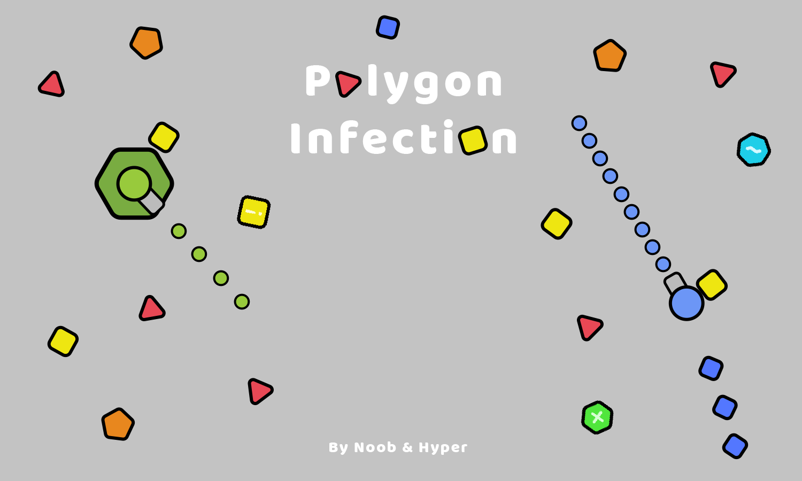

# Polygon Infection (C++)


A small C++ tower-defense style game built with Allegro 5. Defend your base against waves of polygon enemies by placing towers, upgrading stats, and surviving as long as possible.

## Screenshots




## Requirements

- CMake 3.16+
- C++ compiler (g++/clang++)
- Allegro 5 (installed locally via script or system packages)

## Quick Start (Recommended)

This installs Allegro locally into the project and builds the game:

```bash
./scripts/build.sh
```

Run the game:

```bash
./build/polygon-infection
```

## Manual Install + Build

Install Allegro locally:

```bash
./scripts/install_deps.sh
```

Then build:

```bash
export PKG_CONFIG_PATH="$PWD/.allegro/lib/pkgconfig:$PWD/.allegro/lib64/pkgconfig:$PKG_CONFIG_PATH"
cmake -S . -B build
cmake --build build
```

## System Packages (Alternative)

If you prefer system packages, set `USE_SYSTEM=1`:

```bash
USE_SYSTEM=1 ./scripts/install_deps.sh
```

Then build:

```bash
cmake -S . -B build
cmake --build build
```

## Notes

- If Allegro is installed in a non-standard prefix, ensure `PKG_CONFIG_PATH` points to the `.pc` directory.
- The build output is `build/polygon-infection`.
